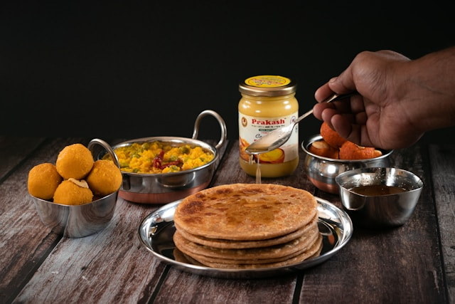

Our first markdown file 

# Name of Project

Here we will first indroduce the project    

## Heading 2

### Heading 3 -sub section 

#### Heading 4- sub-sub section
any text can come here


this ia a normal text 

**This is the bold section**

*This is an italic section*

~~This is a strikethrough section~~

**This is bold with one word *italic* section**

__Another way to make a bold section__

_Another way to make a italic section_

[text](https://chatgpt.com/c/6746aa36-5ed4-8012-af2b-191a26369fcd)




[](https://chatgpt.com/c/6746aa36-5ed4-8012-af2b-191a26369fcd)


## Cafes in Vadodara

- The Brewery 
    1. Chicken Bolgenese Pasta
    2. Fish and Chips
    3. Truffle cake
    4. Blueberry Mohito
- Koa Cafe
- Artistry Cafe
+ Cleo's Coffee and more

## Dinner Menu

1. Mattar paneer
    - Paneer : 200 gm
    1. Amul butter
    2. Misty mint
    - Fresh Peas: 100 gm
    - Onion : 2
    - Tomato : 2

2. Aloo jera
    1. Potatoes : 500 gm 
    2. Salt
    3. Jeera
    4. Pepper 
3. Palak paneer
4. Egg Curry


## Conversion Chart
<!-- (:: is used to algin the text in center) -->
|Sr no | From | To | Conversion Rate |
|:-----:|------|-----:|-----|
|1|**USD** | [**INR**](https://en.wikipedia.org/wiki/Indian_rupee) | 84 |
|2| **EUR** | [**INR**](https://en.wikipedia.org/wiki/Indian_rupee) | 89 |


# Code blocks

`Tutorial`

```py
this is used to highlight the code 

for i in range(10):
    println(i+10)

```

> This is a work insped from xyz

Made with 😎😎